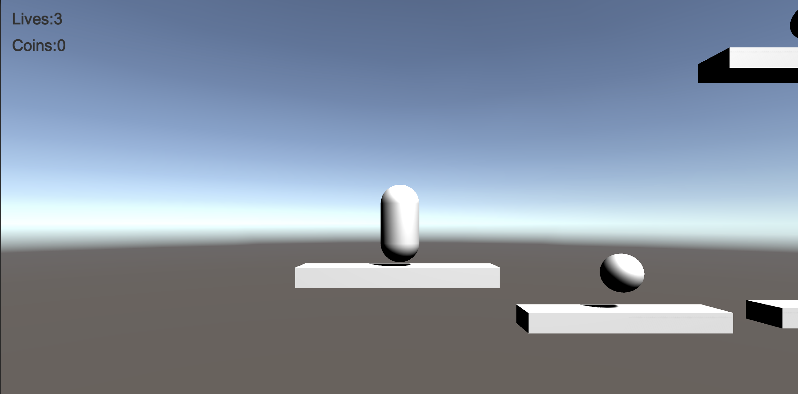
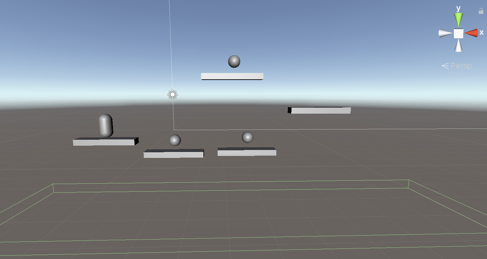

# 2.5D-Platformer-Pro
Platformer Project developed following the Udemy Course [The Ultimate Guide to Game Development with Unity 2019](https://www.udemy.com/course/the-ultimate-guide-to-game-development-with-unity/), thanks to [GameDevHQ](https://gamedevhq.com/).

## Infos

This project will handle:
- Collisions
- Character Controller with gravity, motions and double jump behavior
- Platforms motion
- Dead Zone that handle the restart player position
- Collectable objects like coins
- UI Visualization infos (like coins count and lives)

## Screenshots

